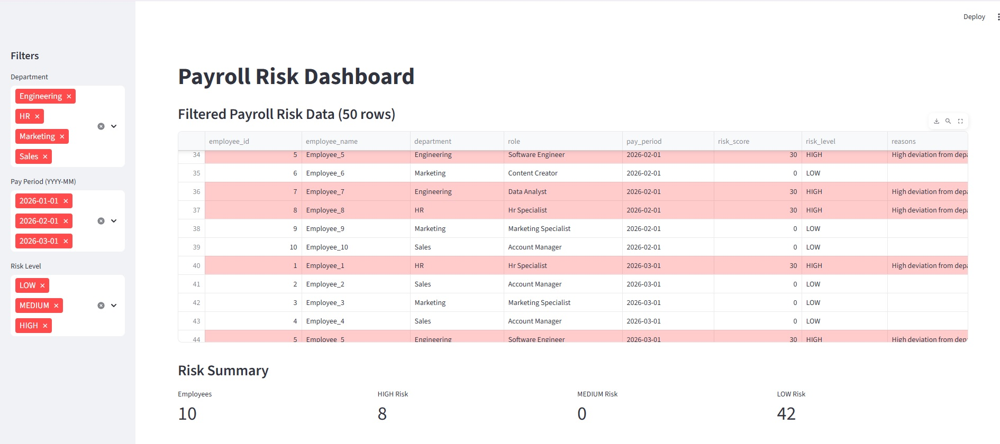

# Payroll Insights - Agentic Payroll Risk Detection Platform
## 📌 Project Overview

Payroll Insights is and end-to-end data engineering and analytics project that detects payroll anomolies, scores employee-level risk using agent-based logic, and surfaces insights through automated alerts and a dashboard.

The system simulates monthly payroll data, process it through a modular ETL pipeline, generates risk signals, executes a rule-based risk scoring agent, and provides visibility through a streamlit dashboard.

the project is designed with production-orientated architecture principles, including centralized catabase access, orchestration design, and extensibility for real-time and ML-based enhancements.

## 🛠️ Tech Stack & Tools
### Programming & Framworks
- Python 
- PANDAS -Data processing and  transformations
- SQLAlchemy - database ORM and connection Management
- VS CODE -Code Editor
### DATABSE
- MySql - storage for payroll data, signals, risk scorses
### Orchestration
- Apache Airflow - workflow orchestration (design-level, linux-targeted)
### Visualization
- STreamlit - interactive dashboard for payroll risj monitoring

## ⚙️ Features
- Synthetic monthly payroll data generation
- Centralized ETL pipeline with modular stages
- Payroll anomaly and signal detection
- Rule-based agentic risk scoring engine
- Risk persistence with deduplication logic
- Interactive streamlit dashboard with filters

## 🧰 Backend Setup / Prerequisites
Before running the pipeline, install the following libraries and tools:

### Python Libraries

pip install pandas requests mysql-connector-python matplotlib seaborn python-dotenv

## System/External Tools
- MySQL Server & Workbench(for databse storage)
- Steamlit for dashboard visualization

## Environmental Variables
Create a .env file in the project root with the following:
- DB_HOST = localhost
- DB_PORT = 3306
- DB_NAME = payroll_db
- DB_USER = your_user
- DB_PASSWORD = your_password

    
## Insights
The playform indentifies and scores payroll risks such as:
- Net pay mismatches
- Sudden salary spikes
- Excessive overtime patterns
- Low net pay compared to department averages
- Unusual deviations from historical payroll trends

Each employee and pay period receives:
- A **risk score**
- A **risk level**(LOW/MEDIUM/HIGH)
- A **human-readable explantion** of contribution factors

## Future Improvements
- Replace rule-based risk scoring with ML models
- Real-time ingestion using kafka or event streams
- Slack/Teams alert integrations
- Historical tren visualization
- Role-based dashboard access
- Deployment via Docker & kubernetes
- Cloud-based Airflow execution

## Quick summary
This project is an **end-to-end ETL pipeline** that :
- End-to-end payroll risk analytics platform
- Agent-based anomaly detection and scoring
- Database-backed, modular ETL pipeline
- Designed for orchestration with Apache Airflow
- Dashboard visualization
- Built with production architecture and principles

